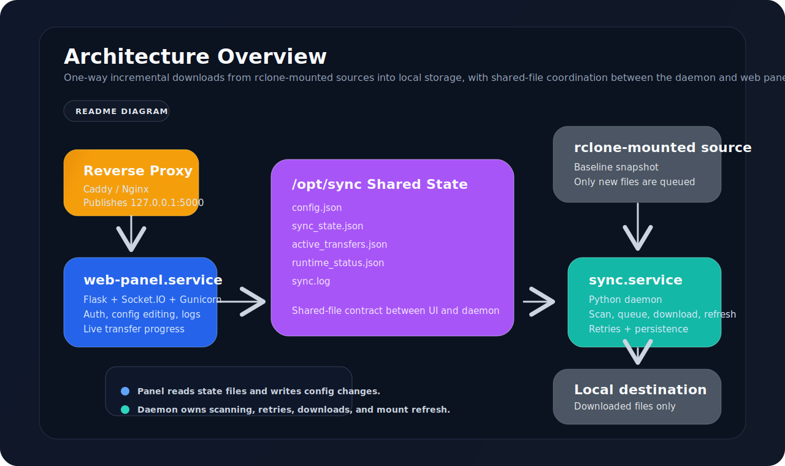

# auto_download_from_drive（rclone 增量下载守护进程）

[](https://www.python.org/)
[](https://flask.palletsprojects.com/)
[](https://socket.io/)
[](https://gunicorn.org/)
[](https://rclone.org/)
[](https://systemd.io/)
[](https://kernel.org/)

<p align="center">
  
</p>

[English](./README.md)

`auto_download_from_drive` 是一个运行在 Linux 上的**单向增量下载守护进程**，用于把 **rclone 挂载目录**中新出现的文件自动拉到本地目录。

它解决的是一个很明确的场景：

- 第一次扫描只建立基线，不回补历史文件
- 只处理之后新出现的文件
- 通过 `rclone copy` 做实际下载
- 状态、日志、运行时计数、传输进度全部落盘
- 提供一个仅监听本机的 Flask Web 面板做配置和监控

这不是双向同步，不是镜像同步，也不会删你本地文件。

## 一眼看懂

- **增量语义明确**：已有文件标记为 `baseline`，不会自动补下
- **支持多条规则**：一个守护进程可管多组 `source_path -> dest_path`
- **支持并发下载**：由 `max_concurrent_downloads` 控制
- **运行态可恢复**：状态持久化，重启后可继续工作
- **挂载刷新更稳**：只有在没有活跃/排队下载时才会重启 rclone 挂载服务
- **面板带认证**：API Key、Session、CSRF、Socket.IO 进度推送都在

## 技术栈

| 层级 | 技术 |
|---|---|
| 守护进程 | Python 3、标准库 `threading` / `queue` / `subprocess` |
| 文件传输 | `rclone copy`，可选使用 RC 接口抓进度 |
| 服务管理 | `systemd` |
| Web 后端 | Flask 3.0、Flask-SocketIO 5.x、Flask-CORS |
| Web 服务进程 | Gunicorn、gevent、gevent-websocket |
| 前端交付 | 服务端模板 + Socket.IO 客户端 |
| 部署模型 | Debian / Ubuntu 风格 Linux 主机 + 本地反向代理 |

核心 Python 依赖见 [`web_panel/requirements.txt`](./web_panel/requirements.txt)：

- `flask==3.0.0`
- `flask-socketio==5.3.5`
- `flask-cors==4.0.0`
- `requests==2.31.0`
- `python-socketio==5.10.0`
- `gunicorn>=21.2.0`
- `python-dotenv>=1.0.0`
- `gevent>=23.9.1`
- `gevent-websocket>=0.10.1`

## 架构

守护进程和 Web 面板之间**没有直接 IPC**，而是通过 `/opt/sync` 下面的共享文件协作。

```text
[ 反向代理 ]
      |
      v
[ web-panel.service ]
      |
      | 读写
      v
[ /opt/sync ]
  - config.json
  - sync_state.json
  - active_transfers.json
  - runtime_status.json
  - sync.log
      ^
      | 读写
      |
[ sync.service ]
      |
      v
[ rclone 挂载源目录 ]
```

## 工作机制

### 文件状态流转

```text
规则首次初始化时已存在 -> baseline
后续新发现             -> pending
pending -> 成功         -> synced
pending -> 失败         -> failed
failed  -> 达到重试上限 -> permanent_failed
```

传输注册表里的键格式是 `<rule_id>:<source_file_path>`。

### 挂载刷新逻辑

每过 `rclone_refresh_interval_seconds`，守护进程会：

1. 先检查活跃下载数和排队下载数是否都为 0
2. 只要还有活跃任务或排队任务，就直接跳过本轮刷新
3. 只有确认空闲后才暂停扫描
4. 重启配置里的 rclone systemd 服务
5. 持续探测已启用规则的源路径，直到挂载恢复可用
6. 然后恢复正常扫描

## 快速开始

### 生产环境安装

```bash
sudo ./start.sh
```

当前安装脚本会：

- 重建 `/opt/sync`
- 从 GitHub `main` 分支拉取受跟踪文件
- 创建 `config.json` 和 `web_panel/.env`
- 创建 `web-panel` 系统用户
- 为面板安装 Python 虚拟环境
- 写入 `sync.service` 和 `web-panel.service`
- 写入 sudoers / polkit 规则，允许面板管理 `sync.service`

注意：

- `start.sh` 对已有 `/opt/sync` 安装是破坏性重装
- 安装内容跟随远端 GitHub `main` 分支，不跟随你本地未提交代码

### 首次配置

编辑 `/opt/sync/config.json`：

```json
{
  "scan_interval_seconds": 300,
  "rclone_refresh_interval_seconds": 1800,
  "max_concurrent_downloads": 3,
  "max_retry_count": 5,
  "bandwidth_limit_mbps": 0,
  "rclone_command": "rclone",
  "rclone_service_name": "rclone-pikpak",
  "rules": [
    {
      "source_path": "/mnt/pikpak/incoming",
      "dest_path": "/data/downloads",
      "enabled": true
    }
  ]
}
```

然后：

```bash
sudo systemctl restart sync.service
```

编辑 `/opt/sync/web_panel/.env`：

```env
WEB_PANEL_API_KEY=replace-with-a-strong-random-value
WEB_PANEL_ALLOWED_ORIGINS=https://panel.example.com
WEB_PANEL_SECRET_KEY=generated-or-custom-secret
WEB_PANEL_SESSION_TTL_SECONDS=1800
WEB_PANEL_LOG_LEVEL=INFO
WEB_PANEL_AUTH_MAX_FAILURES=10
WEB_PANEL_AUTH_WINDOW_SECONDS=600
WEB_PANEL_AUTH_LOCKOUT_SECONDS=900
WEB_PANEL_AUTH_CLEANUP_INTERVAL=300
```

然后：

```bash
sudo systemctl restart web-panel.service
```

### 反向代理

面板只监听 `127.0.0.1:5000`，需要通过 Caddy、Nginx 或其他反向代理暴露。

Caddy 示例：

```caddy
panel.example.com {
    @allowed remote_ip YOUR.IP.ADDRESS
    handle @allowed {
        reverse_proxy 127.0.0.1:5000
    }
    respond 403
}
```

## 本地开发

```bash
python3 -m venv .venv
source .venv/bin/activate
pip install -r web_panel/requirements.txt
python3 -m py_compile sync_daemon.py web_panel/app.py web_panel/rclone_monitor.py
python3 web_panel/app.py
```

本地调试面板前，先给必要环境变量：

```bash
export WEB_PANEL_API_KEY=dev-key
export WEB_PANEL_SECRET_KEY=dev-secret
export WEB_PANEL_ALLOWED_ORIGINS=http://localhost:5000
```

## 配置说明

### `config.json`

| 字段 | 类型 | 说明 |
|---|---|---|
| `scan_interval_seconds` | int | 增量扫描间隔 |
| `rclone_refresh_interval_seconds` | int | 挂载刷新周期 |
| `max_concurrent_downloads` | int | 下载 worker 数量 |
| `max_retry_count` | int | 进入 `permanent_failed` 之前的失败阈值 |
| `bandwidth_limit_mbps` | number | `0` 表示不加 `--bwlimit`；否则按 `XM` 传给 rclone |
| `rclone_command` | string | `rclone` 二进制名或绝对路径 |
| `rclone_service_name` | string | 刷新挂载时要重启的 systemd unit |
| `rules` | array | 下载规则列表 |

### 规则字段

| 字段 | 类型 | 说明 |
|---|---|---|
| `source_path` | string | rclone 挂载源目录的绝对路径 |
| `dest_path` | string | 本地下载目标目录的绝对路径 |
| `enabled` | bool | 是否启用该规则 |

### Web 面板 `.env`

| 变量 | 必填 | 默认值 | 说明 |
|---|---|---|---|
| `WEB_PANEL_API_KEY` | 是 | 无 | `/api/*` 的认证 API Key |
| `WEB_PANEL_SECRET_KEY` | 是 | 运行时无默认 | Flask Session 密钥 |
| `WEB_PANEL_ALLOWED_ORIGINS` | 否 | `http://localhost,https://localhost` | CORS 和 Socket.IO 允许来源 |
| `WEB_PANEL_SESSION_TTL_SECONDS` | 否 | `1800` | 滑动 Session 有效期 |
| `WEB_PANEL_LOG_LEVEL` | 否 | `INFO` | 面板日志级别 |
| `WEB_PANEL_AUTH_MAX_FAILURES` | 否 | `10` | 单个认证窗口内允许失败次数 |
| `WEB_PANEL_AUTH_WINDOW_SECONDS` | 否 | `600` | 失败次数统计窗口 |
| `WEB_PANEL_AUTH_LOCKOUT_SECONDS` | 否 | `900` | 临时封禁时长 |
| `WEB_PANEL_AUTH_CLEANUP_INTERVAL` | 否 | `300` | 过期限流记录清理间隔 |

## Web 面板安全模型

当前 [`web_panel/app.py`](./web_panel/app.py) 的行为：

- `WEB_PANEL_API_KEY` 启动时必须存在
- `WEB_PANEL_SECRET_KEY` 启动时必须存在
- API Key 认证成功后会升级为 HttpOnly Session
- 基于 Session 的危险请求必须带合法 `Origin` 或 `Referer`
- 基于 Session 的危险请求还必须带 `X-CSRF-Token`
- 认证失败按客户端 IP 做限流和临时封禁
- 没有有效 Session 的 Socket.IO 连接会被拒绝

## 管理 API

当前主要接口：

- `POST /api/auth`
- `GET /api/config`
- `POST /api/config`
- `POST /api/config/rules`
- `DELETE /api/config/rules/<rule_index>`
- `GET /api/state`
- `GET /api/stats`
- `GET /api/logs`
- `GET /api/transfers`
- `GET /api/progress`

## 仓库结构

```text
.
├── sync_daemon.py
├── start.sh
├── update.sh
├── README.md
├── zh_README.md
└── web_panel/
    ├── app.py
    ├── rclone_monitor.py
    ├── requirements.txt
    ├── README.md
    └── templates/
        └── index.html
```

## 运维

### 更新已有安装

```bash
sudo ./update.sh
```

`update.sh` 会保留：

- `/opt/sync/config.json`
- `/opt/sync/web_panel/.env`

### 常用命令

```bash
sudo systemctl status sync.service
sudo systemctl status web-panel.service

sudo journalctl -u sync.service -f
sudo journalctl -u web-panel.service -f
sudo tail -f /var/log/web-panel/error.log

cat /opt/sync/sync_state.json | python3 -m json.tool
cat /opt/sync/active_transfers.json | python3 -m json.tool
```

## 已知限制

- 启用规则第一次扫描时做的是“建立基线”，不是“补历史文件”。
- `bandwidth_limit_mbps` 这个名字像 Mbps，但当前实现是把数值直接按 rclone 的 `M` 传进去。
- `POST /api/config/rules` 和 `DELETE /api/config/rules/<rule_index>` 只改 `config.json`，不会自己重启 `sync.service`。
- Web UI 里带宽文案目前写的是 `MB/s`，而后端字段名叫 `bandwidth_limit_mbps`。
- `max_retry_count=0` 会让第一次失败直接进入 `permanent_failed`。

## 相关文件

- [`sync_daemon.py`](./sync_daemon.py)
- [`start.sh`](./start.sh)
- [`update.sh`](./update.sh)
- [`web_panel/app.py`](./web_panel/app.py)
- [`web_panel/README.md`](./web_panel/README.md)
